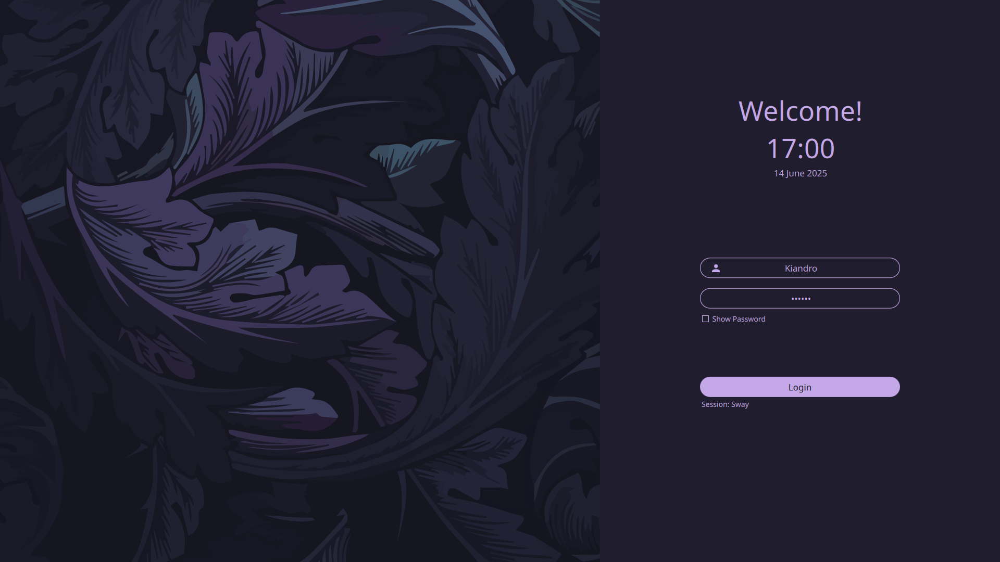
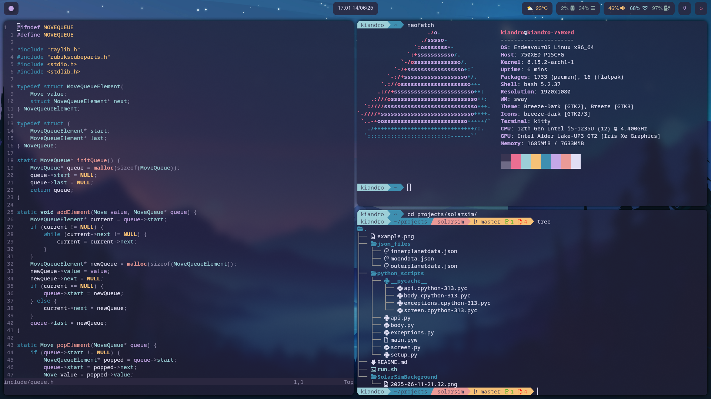
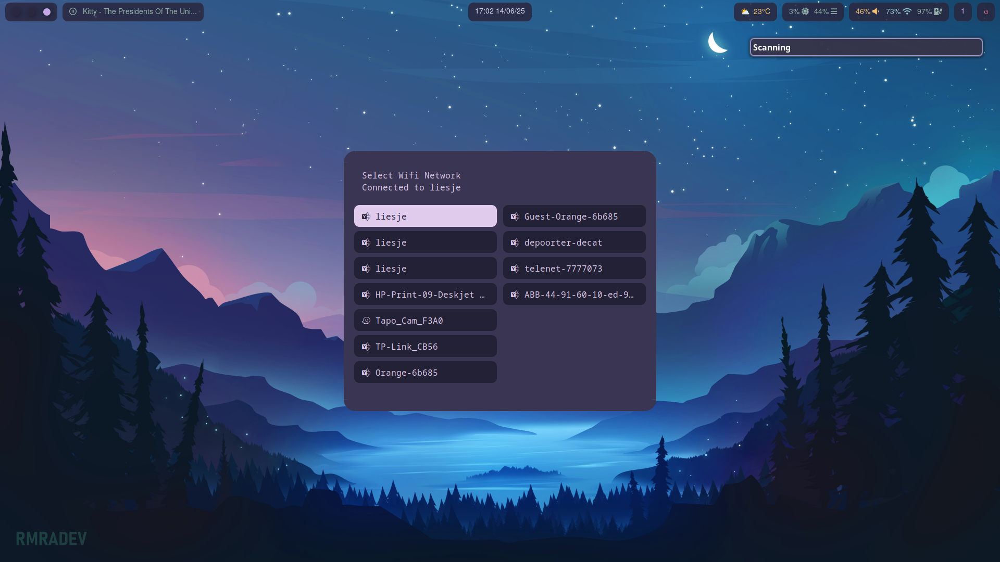
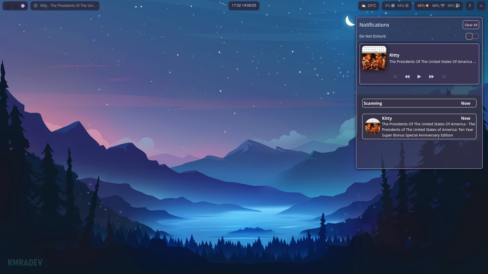

# My SwayFX config

## Specs:
```sh
- Distro:  EndeavourOS Mercury
- WM: SwayFX
- Shell: Bash

- PC: Samsung Galaxy Book 2 (750XED)
- CPU: Intel core i5
- GPU: Intel iRIS xe
- Resolution: 1920x1080

- Terminal: Kitty
- Theme: Rosé Pine Moon
- Editor: NeoVim
```

## Showcase:
[](./images/20250614_17h00m26s_grim.png)
[](./images/20250614_17h01m30s_grim.png)
[](./images/20250614_17h02m21s_grim.png)
[](./images/20250614_17h02m51s_grim.png)
[](./images/20250614_17h02m58s_grim.png)

## Credits:
All these people gave me much inspiration (and code) for my config. Some of my
configs are almost exact copies while others were more to work out an idea.
* nvim: [BWindey](github.com/BWindey/nvim-config)
* rofi (app launcher/wifi): [niraj998](https://github.com/niraj998/Rofi-Scripts)
* sddm: [POP303U](https://github.com/POP303U/rose-pine-sddm)
* spicetify: [Comfy-Themes](https://github.com/Comfy-Themes/Spicetify)
* swaync: [MrRoy](https://gist.github.com/MrRoy/40f103bc34f3a58699e218c3d06d1a43)
* waybar: [PROxZIMA](https://github.com/PROxZIMA/.dotfiles)


